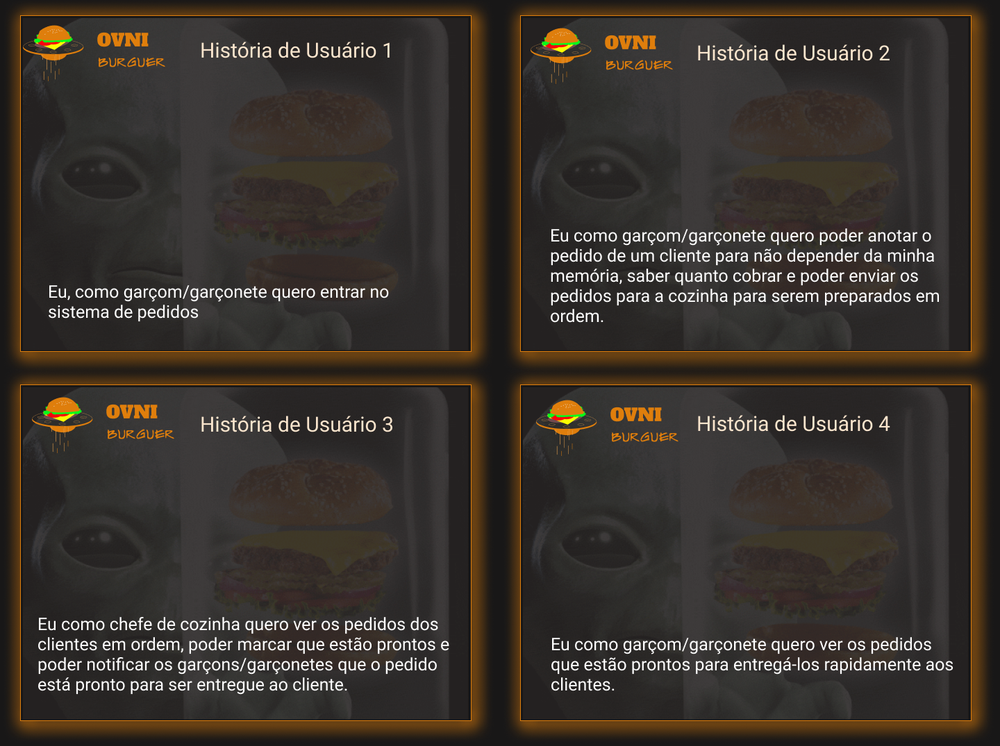
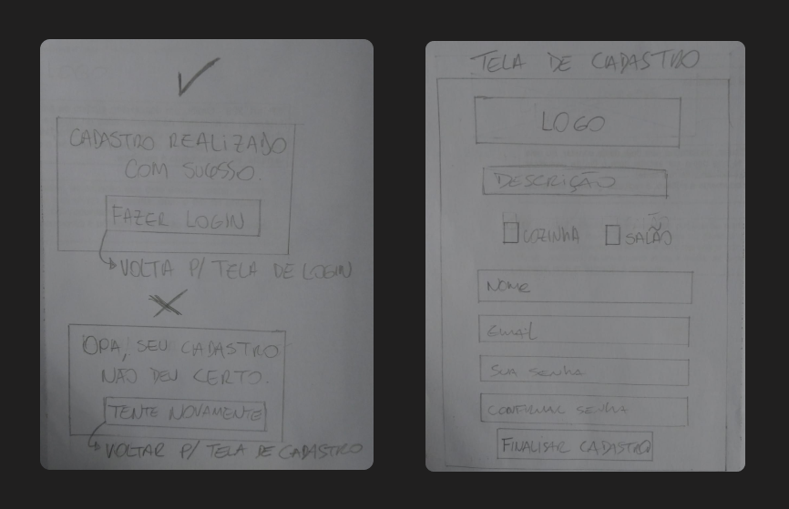
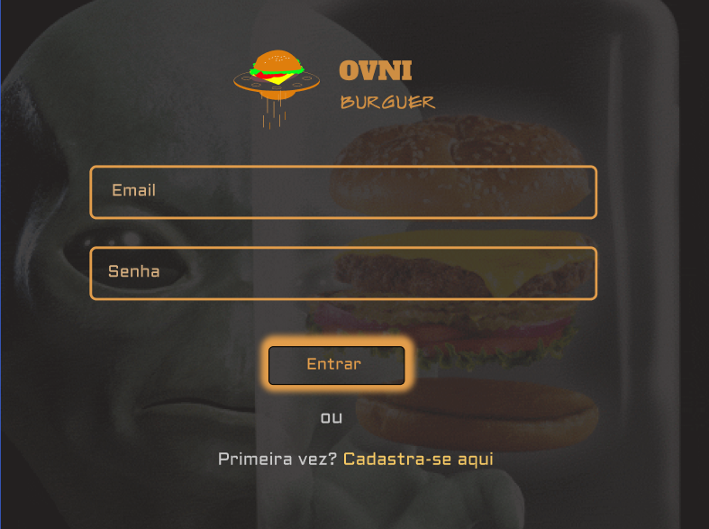

# Hamburgueria Ovni Burguer

## 1. 🎯Produto

Ovni Burguer é uma aplicação desenvolvida pensando na experiência do funcionário que necessita lidar todos os dias com os pedidos de seus clientes. O garçom precisa anotar os pedidos de forma simples, objetiva e eficiente e quando enviar para a cozinha, o responsável pela preparação deste alimento precisa saber os pedidos pendentes e marcar os que ele já finalizou e avisar no aplicativo para o garçom que o pedido já pode ser entregue.

## 2. 👩🧑Histórias de Usuário

## 3. 🎨Desenho da Interface de Usuário (protótipo de baixa fidelidade)

## 4. Como funciona?

Neste vídeo mostra um pouco as funcionalidades como:
1) Cadastro e Login do usuário;
2) Rota direcionada para o setor cadastrado;
3) Seleção dos produtos que aparecem diretamente na comanda onde se tem a opção de excluir;
4) Alerta para o garçom quando tem algum pedido pronto para ser entregue ao cliente final;
5) Possibilidade de marcar o pedido como entregue e ver o histórico;
6) Pedidos chegam para a cozinha ordenados, conforme a solicitação.

## 7. 👨‍💻Objetivos de aprendizagem

O objetivo principal de aprendizagem deste projeto desenvolvido durante o bootcamp da Laboratoria é aprender a construir uma aplicação SPA com o uso da biblioteca React. Além do React utilizamos para o CSS, styled components.

#### Javascript

#### React

#### Swagger (consumir dados da API)

#### Testing

#### Git e Github

### 👩‍🔧Desenvolvedoras
- [@tamaracosta](https://www.github.com/tamaracosta) 

- [@tauanapacheco](https://github.com/Tauana-Pacheco) 
